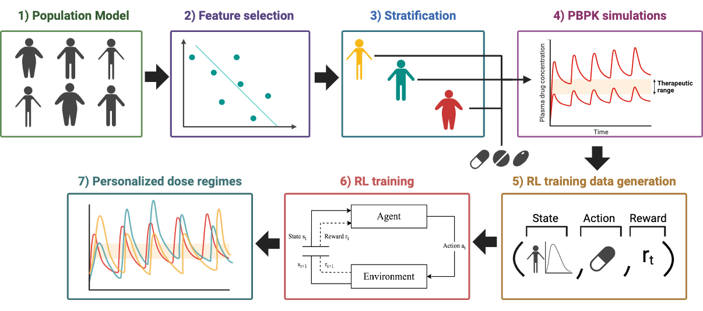

# PopPBPK-RL_Bnzpril
This repository contains the codebase for a RL-based model-informed precision dosing of Benazepril in renal impaired patients. Training data is generated based on a virtual population for accounting variability of patients characteristics. On this virtual population, patient stratification and feature selection is also performed to better handle dose tailoring problems. The stratified population is used to perform PBPK modeling to obtain pharmacokinetic response for each patient to different Benazepril doses during 7 days of treatment. Then, pharmacokinetic response data is used in combination with RL for obtaining patient tailored dose regimes.

<!---  --->

## Versions used 

- R: 4.3.2
- Python: 3.12.0

## Installation 

Clone this repository into your local machine

```
git clone git@github.com:lucis-e/PopPBPK-RL_Bnzpril.git
cd PopPBPK-RL_Bnzpril
```

>[!TIP]
>To run this project, ensure you have Python 3.12.0 and R 4.3.2 installed on your system. You can download Python from [python.org](https://www.python.org/downloads/release/python-3120/) and R from [cran.r-project.org](https://cran.r-project.org/bin/windows/base/). Additionally, we recommend installing RStudio for a more convenient development environment. You can download RStudio from 
[rstudio.com](https://www.rstudio.com/products/rstudio/download/).

Required dependencies can be installed by running:

```
pip install -r requirements.txt
```

## How to run this project?

Please follow these steps indicating the order in which each code script should be executed

### 1. Feature selection and virtual population stratification

:one:  <span style="color:blue"> **MLR analysis for feature selection** </span>

Run the R Markdown notebook to perform MLR and partial correlation coefficient analysis, discovering the anthropometric parameters that are most influential in PK profile prediction.

:two: **Virtual population stratification based on the extracted features**

Run the Python notebook to classify the virtual population into the defined strata based on the MLR-selected features and calculate the distribution of the PK parameters in each group.


### 2. RL agent

:three: **Extract the PopPBPK experiences** 

Run the `ExperienceGenerator.py` script to extract experiences of the agent's interaction with the environment (the PopPBPK simulated 
patient's PK profiles) from data. The module `RewardFunction.py` is required for this script to run and admits any other reward function candidates.

```
python ExperienceGenerator.py
```

:four: **Train the RL model**

Train the RL-agent with Q-Learning algorithm by running the `RL-T.py` script and generate a Q-table to be consulted in order to predict the optimal dosing regimens.

```
python RL-T.py
```

>[!NOTE]
> The Q-Learning algorithm would employ the optimal combination of hyperparameters (learning rate and discount factor) discovered by grid search. To 
repeat model's **hyperparameter tuning** the following code should be run:

```
cd ParameterTuning
python RL-T_tuning.py
python RL-P_tuning.py
```

:five: **Retrieve the RL-learned dosing regimens**

Run the `RL-P.py` script to retrieve the resulting RL-predicted Benazepril dosing regimens for each of the 40 patient strata.

```
python RL-P.py
```

## Data

The data employed in this project is available under formal request to: 


## Contributors 

Guillermo Vigueras

Lucía Muñoz-Gil

Valerie Reinisch

Joana T. Pinto


## License
Shield: [![CC BY-NC-SA 4.0][cc-by-nc-sa-shield]][cc-by-nc-sa]

This work is licensed under a
[Creative Commons Attribution-NonCommercial-ShareAlike 4.0 International License][cc-by-nc-sa].

[![CC BY-NC-SA 4.0][cc-by-nc-sa-image]][cc-by-nc-sa]

[cc-by-nc-sa]: http://creativecommons.org/licenses/by-nc-sa/4.0/
[cc-by-nc-sa-image]: https://licensebuttons.net/l/by-nc-sa/4.0/88x31.png
[cc-by-nc-sa-shield]: https://img.shields.io/badge/License-CC%20BY--NC--SA%204.0-lightgrey.svg

